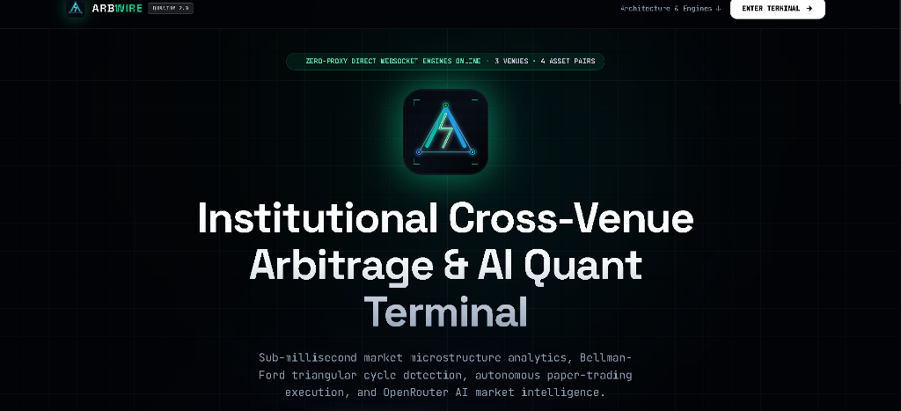
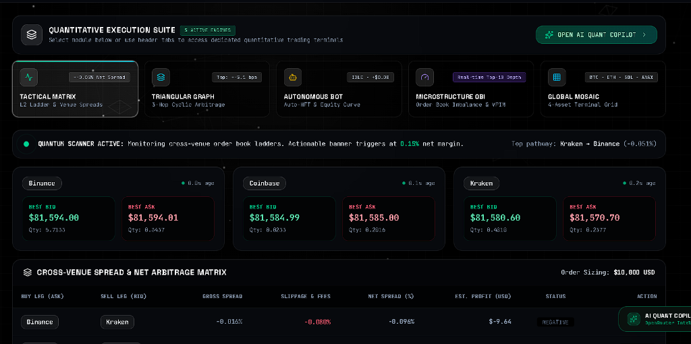
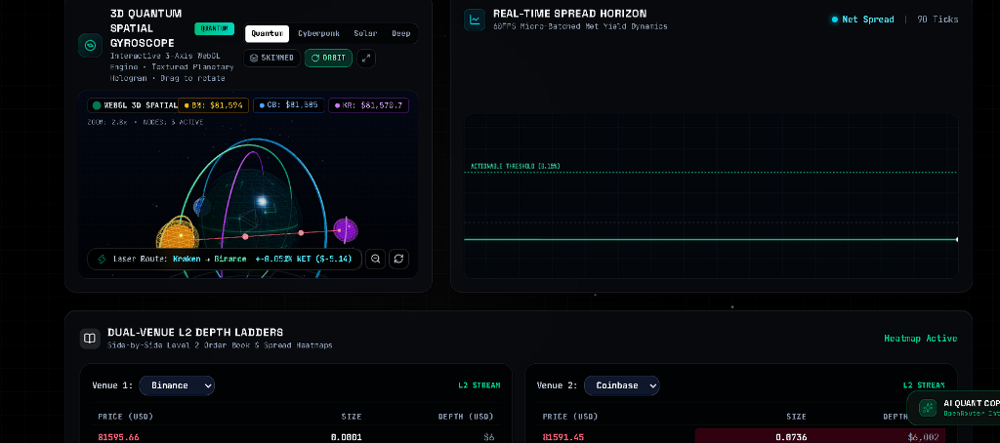

# Arbwire Quantum ⚡ Institutional Quantitative Arbitrage & Spatial Telemetry Suite

Arbwire is an open-source, high-performance quantitative workstation engineered for real-time cryptocurrency cross-venue arbitrage detection, microstructural order book analytics (VPIN / OBI), triangular arbitrage execution routing, and sub-millisecond network latency telemetry across Binance, Coinbase, and Kraken.

---

> [!IMPORTANT]
> **Open Source & Non-Liability Disclaimer**:
> Arbwire is an open-source educational and quantitative research project distributed under the MIT License. The developers, maintainers, and contributors **are not responsible for any misuse, financial loss, trading errors, network outages, or problems** arising from the use or deployment of this software. All simulated route fills and metrics are provided strictly on an **"AS IS"** research basis without warranties of any kind.
>
> 📖 **Master Field Guide**: For an exhaustive deep-dive into the mathematics, order book microstructure, and high-frequency algorithms, read [CONCEPTS_AND_GUIDE.md](CONCEPTS_AND_GUIDE.md).

---

## 📸 Terminal Screenshots & Visual Previews

### 1. Institutional Welcome & Initialization Portal


### 2. Tactical Execution Suite & Cross-Venue Arbitrage Matrix


### 3. 3D WebGL Spatial Gyroscope & Real-Time L2 Depth Ladders


---

## 🖥️ Live Architecture & Dashboard Layout

Below is a schematic visual layout of the live **Arbwire Quantum 2.0** terminal:

```
┌─────────────────────────────────────────────────────────────────────────────────────────────────────────────────┐
│  ⚡ ARBWIRE QUANTUM 2.0    [BTC/USDT] [ETH/USDT] [SOL/USDT] [AVAX/USDT]   ● BINANCE 12ms  ● COINBASE 18ms  ● KRAKEN 15ms │
└─────────────────────────────────────────────────────────────────────────────────────────────────────────────────┘
┌───────────────────────────────────────────────────────┬─────────────────────────────────────────────────────────┐
│ 🔲 CROSS-VENUE ARBITRAGE MATRIX (L2 DEPTH ADJUSTED)    │ 🌐 3D QUANTUM SPATIAL GYROSCOPE [SKIN: QUANTUM EMERALD] │
│ Buy \ Sell     Binance       Coinbase      Kraken     │                                                         │
│ Binance          ---         +0.185% ⚡     +0.042%    │          🪐 Binance (Gold)                              │
│ Coinbase       -0.120%         ---         -0.085%    │                 ▲                                       │
│ Kraken         +0.095%       +0.210% ⚡       ---     │      [ Laser Beam: Buy BN ──► Sell CB ]                 │
│                                                       │                 ▼                                       │
│ 🎯 Best Opportunity: BINANCE ──► COINBASE             │          🪐 Coinbase (Blue)   🪐 Kraken (Purple)        │
│ Net Spread: +0.185% (18.5 bps) | Net Profit: +$18.50  │                                                         │
│ [ SIMULATE ROUTE FILL (2-LEG) ]                       │  [WIRED/SKINNED]  [ORBIT/LOCK]  [ZOOM +/-]  [RESET]     │
├───────────────────────────────────────────────────────┴─────────────────────────────────────────────────────────┤
│ 🔬 MICROSTRUCTURE OBI & VPIN TOXICITY GAUGES                                                                   │
│ [BINANCE] OBI: +34.2% (BULLISH) | VPIN Toxicity: 18.5% (LOW RISK) | Implied Shift: +2.1 bps                     │
│ [COINBASE] OBI: -28.1% (BEARISH) | VPIN Toxicity: 24.0% (LOW RISK) | Implied Shift: -1.8 bps                     │
│ [KRAKEN]   OBI: +12.0% (NEUTRAL) | VPIN Toxicity: 14.2% (LOW RISK) | Implied Shift: +0.4 bps                     │
├─────────────────────────────────────────────────────────────────────────────────────────────────────────────────┤
│ 📜 DISCREPANCY CAPTURE AUDIT TRAIL                                                                              │
│ [AUTO INTERVAL: 15s | 30s | 1m | 3m | 5m | 15m | Off]   ● ACTIVE (30s) - Next Snapshot: 00:18 [=====>     ]      │
│ Time       Pair      Type      Route           Buy Leg       Sell Leg      Gross      Net Spread  Profit Status │
│ 11:24:05   BTC/USDT  EXEC      Binance ──► CB  $64,120.00    $64,242.00    +0.190%    +0.185%    +$18.50 SAVED  │
│ 11:23:45   BTC/USDT  AUTO 30s  Binance ──► CB  $64,118.50    $64,238.00    +0.186%    +0.181%    +$18.10 SAVED  │
│ 11:23:15   BTC/USDT  AUTO 30s  Kraken ──► CB   $64,115.00    $64,235.00    +0.187%    +0.182%    +$18.20 UNSAVED│
└─────────────────────────────────────────────────────────────────────────────────────────────────────────────────┘
```

---

## 📥 Example Input & Output Data Streams

### Example 1: L2 Order Book Ingestion $\rightarrow$ Spatial Arbitrage Matrix Output

#### Input (Raw Multi-Exchange WebSocket Ingestion):
```json
{
  "pair": "BTC/USDT",
  "books": {
    "binance": {
      "bids": [[64115.00, 1.50], [64110.00, 3.20]],
      "asks": [[64120.00, 2.10], [64125.00, 4.00]],
      "timestamp": 1774264800100
    },
    "coinbase": {
      "bids": [[64242.00, 1.80], [64235.00, 2.50]],
      "asks": [[64248.00, 1.20], [64255.00, 3.10]],
      "timestamp": 1774264800115
    },
    "kraken": {
      "bids": [[64130.00, 2.00], [64120.00, 3.00]],
      "asks": [[64140.00, 1.50], [64150.00, 2.80]],
      "timestamp": 1774264800108
    }
  },
  "config": {
    "simulatedNotionalUSD": 10000,
    "takerFeeBps": { "binance": 4, "coinbase": 6, "kraken": 4 }
  }
}
```

#### Output (Synthesized Arbitrage Opportunity):
```json
{
  "id": "snap-manual-1774264800120-x9q41",
  "pair": "BTC/USDT",
  "buyExchange": "binance",
  "buyPrice": 64120.00,
  "sellExchange": "coinbase",
  "sellPrice": 64242.00,
  "grossSpreadPct": 0.1903,
  "grossSpreadBps": 19.03,
  "slippagePct": 0.005,
  "totalFeeBps": 10.0,
  "netSpreadPct": 0.1853,
  "netSpreadBps": 18.53,
  "simulatedNotionalUSD": 10000.0,
  "netProfitUSD": 18.53,
  "isActionable": true,
  "estimatedExecutionLatencyMs": 14.2
}
```

---

### Example 2: Triangular 3-Hop Discovery $\rightarrow$ Execution Cycle Output

#### Input (Multi-Hop Asset Matrix):
```
1. Hop 1: Buy BTC with USDT on Binance @ $64,120.00
2. Hop 2: Buy ETH with BTC on Binance @ 0.04820 BTC/ETH
3. Hop 3: Sell ETH for USDT on Coinbase @ $3,115.50
```

#### Output (Triangular Execution Route):
```json
{
  "id": "tri-1774264800350",
  "baseAsset": "USDT",
  "executionPathStr": "USDT ──► BTC ──► ETH ──► USDT",
  "grossReturnMultiplier": 1.00285,
  "netReturnMultiplier": 1.00165,
  "netSpreadPct": 0.165,
  "netSpreadBps": 16.5,
  "simulatedNotionalUSD": 10000,
  "netProfitUSD": 16.50,
  "isActionable": true,
  "estimatedLatencyMs": 28.5
}
```

---

### Example 3: Sub-Millisecond Welford Telemetry Output

#### Input (Raw Packet Arrival Deltas in ms):
$$x_k = [14.2, 16.8, 12.1, 15.4, 22.1, 13.9, 14.8]$$

#### Output (Real-Time Latency Metric State):
```json
{
  "exchange": "binance",
  "connectionState": "CONNECTED",
  "pingRttMs": 14.5,
  "avgPingRttMs": 15.2,
  "minPingRttMs": 11.8,
  "maxPingRttMs": 24.1,
  "packetJitterMs": 1.84,
  "msgPerSecond": 42,
  "totalMessages": 18450,
  "droppedMessages": 0,
  "queueSaturationPct": 4.2,
  "orderBookDriftMs": 2.1
}
```

---

### Example 4: Autonomous Discrepancy Snapshot $\rightarrow$ Export Format

#### Output (CSV Export Line):
```csv
Timestamp,Time (ISO),Pair,Buy Exchange,Buy Price,Sell Exchange,Sell Price,Gross Spread (%),Net Spread (%),Net Profit ($),Actionable,Capture Type,Capture Interval,Saved Status
1774264800000,2026-09-21T11:20:00.000Z,BTC/USDT,binance,64120.00,coinbase,64242.00,0.190,0.185,18.50,YES,auto,30s,SAVED
```

---

## 🚀 Key Modules & Capabilities

1. **Multi-Venue Public WebSocket Feed Ingestion**:
   - Concurrently ingests Level 2 order books and depth updates from Binance, Coinbase, and Kraken.
   - Zero API keys or authentication required for public feeds.
2. **Quantitative Arbitrage Engine**:
   - Computes instantaneous Top-of-Book and VWAP-adjusted cross-venue spreads.
   - Simulates walking the true L2 order book depth for user-defined block sizes ($1,000 to $100,000+).
3. **Discrepancy Capture Audit Trail**:
   - Autonomous periodic snapshots with configurable intervals (**15s, 30s, 1m, 3m, 5m, 15m**).
   - Instantaneous market capture at the expiration second with auto-purging of unsaved entries upon interval modification.
4. **3D WebGL Spatial Gyroscope**:
   - Interactive 3-axis gimbal gyroscope with butter-smooth inertia damping and touch support.
   - Procedural planetary surface skins (**Quantum Emerald**, **Cyberpunk Neon**, **Solar Plasma**, **Deep Space Matrix**).
   - Orbiting venue satellites with dynamic laser vector beams and traveling energy pulses.
5. **Microstructure Alpha & Triangular Cycles**:
   - Order Book Imbalance (OBI) & Volume-Synchronized Probability of Toxicity (VPIN).
   - Automated 3-hop triangular route discovery.
6. **Network Latency Telemetry**:
   - Online Welford packet jitter, round-trip time (RTT), and clock drift telemetry.

---

## 🛠️ Quickstart

### Prerequisites
- Node.js 18+
- npm or yarn

### Installation
```bash
# Clone the repository
git clone https://github.com/uzairphalgroo/finance.git

# Navigate to the project directory
cd "finance/projects/Arbwire Arbitrager"

# Install dependencies
npm install
```

### Development Server
```bash
npm run dev
```
Open [http://localhost:5173](http://localhost:5173) in your browser.

### Run Unit Tests
```bash
npm test
```

### Build Production Bundle
```bash
npm run build
```

---

## ⌨️ Power-User Keyboard Shortcuts

| Key Shortcut | Action |
|:---|:---|
| <kbd>⌘K</kbd> / <kbd>Ctrl+K</kbd> | Open Power-User Command Interpreter |
| <kbd>1</kbd> - <kbd>4</kbd> | Quick Switch Active Trading Pairs (BTC, ETH, SOL, AVAX) |
| <kbd>C</kbd> | Open Engine Configuration & Fee Presets Modal |
| <kbd>M</kbd> | Toggle Acoustic Audio Synthesis Chimes |
| <kbd>A</kbd> | Toggle OpenRouter AI Quant Copilot Slide-out Drawer |
| <kbd>G</kbd> / <kbd>?</kbd> | Open Interactive User Manual & Quantitative Glossary |

---

## 📁 Repository Structure

```
Arbwire Arbitrager/
├── CONCEPTS_AND_GUIDE.md             # Master Quantitative & Microstructure Guide
├── LICENSE                           # Open Source MIT License with Disclaimer
├── PRIVACY.md                        # Client-side Privacy Policy
├── TERMS.md                          # Terms of Service & Limitation of Liability
├── SECURITY.md                       # Security Policy & Vulnerability Reporting
├── README.md                         # Main Dashboard Guide & Architecture
├── package.json
├── tsconfig.json
└── vite.config.ts
```

---

## 📄 License & Open-Source Policy

Distributed under the **MIT License**. See [LICENSE](LICENSE) for full legal text.

**Disclaimer**: Arbwire is an open-source educational project. The creators and contributors are not responsible for any misuse, financial losses, or trading errors.
